<div align="center">


# Mahhl | محل — منصة التجارة الإلكترونية العربية المدعومة بالذكاء الاصطناعي

**متجر إلكتروني كامل بمعايير عالمية + محرك سلوك ذكي + وكيل مبيعات بالذكاء الاصطناعي يصرف طلبات حقيقية**

[](https://nextjs.org)
[](https://react.dev)
[](https://www.typescriptlang.org)
[](https://tailwindcss.com)
[](https://www.prisma.io)
[](https://neon.tech)
[](https://www.deepseek.com)
[](#الترخيص)

[🚀 ديمو مباشر على الإنتاج](https://mahhl-qzjn.vercel.app) · [📦 المستودع](https://github.com/ahmedezzatelsayad/Mahhl) · [⚡ الإعداد السريع](#دليل-الإعداد-الكامل)

منصة تُدار بالكامل من لوحة تحكم عربية — من 2,638 منتجًا إلى 53,087 تقييمًا باللهجة الكويتية، من وكيل مبيعات يفاوضك باللهجة الكويتية ويُصرف طلبك فعليًا إلى تتبع Conversions API لفيسبوك — كل شيء في مستودع واحد.

</div>

---

## 📖 جدول المحتويات

| # | القسم | # | القسم |
|---|-------|---|-------|
| 1 | [نظرة عامة وإحصائيات المشروع](#نظرة-عامة-وإحصائيات-المشروع) | 6 | [مرجع API الكامل — 51 مسارًا](#مرجع-api-الكامل--51-مسارا) |
| 2 | [لقطات الشاشة](#لقطات-الشاشة) | 7 | [دليل الإعداد الكامل](#دليل-الإعداد-الكامل) |
| 3 | [جدول الميزات الشامل](#جدول-الميزات-الشامل) | 8 | [النشر على الإنتاج (Vercel + Neon)](#النشر-على-الإنتاج-vercel--neon) |
| 4 | [المعمارية التقنية](#المعمارية-التقنية) | 9 | [أدوات السكربتات والأداء والجودة](#أدوات-السكربتات-والأداء-والجودة) |
| 5 | [نماذج قاعدة البيانات](#نماذج-قاعدة-البيانات) | 10 | [خارطة الطريق والمؤلف](#خارطة-الطريق-والمؤلف) |
| 11 | [الأسئلة الشائعة للمطورين (FAQ)](#الأسئلة-الشائعة-للمطورين-faq) | | |

---

## 🌟 نظرة عامة وإحصائيات المشروع

**Mahhl (محل)** ليس قالب متجر آخر. إنه نظام تجارة إلكترونية متكامل بُني خصيصًا للسوق الكويتي والخليجي، يدمج واجهة متجر عربية/إنجليزية كاملة (RTL/LTR) بمعايير Baymard وNN/g وWCAG، مع **طبقة ذكاء اصطناعي عمودية** تعمل على أربع خدمات مستقلة: وكيل مبيعات يحاور العميل ويُصرف طلبات حقيقية عبر نفس منطق الدفع المحصّن، محرك Upsell يفهم نية الشراء ومستوى الميزانية، محرك Bought-together بأسلوب أمازون (شراء مشترك > مشاهدة مشتركة > نفس الفئة)، ومكتب تحرير لمحتوى المنتجات يعمل بنموذج DeepSeek v4 Thinking.

كل قرار هندسي في المشروع مدعوم ببحث موثّق — من نسب التخلي عن السلة (70.19% وفق Baymard) إلى أثر التقييمات على التحويل (+270% وفق Kissmetrics) إلى معامل التحويل 6.4x لمستخدمي البحث الداخلي — وقد أُرشفت المصادر داخل `scripts/research/` للمراجعة.

### إحصائيات الكود الفعلية (مستخرجة آليًا من المستودع)

| المؤشر | القيمة | التفاصيل |
|--------|:------:|----------|
| 🔌 مسارات API | **51** | موزعة على 15 مجموعة وظيفية بمنطق REST كامل |
| 🛍️ مكوّنات واجهة المتجر | **29** | Views + Widgets: من السلايدر إلى Exit-Intent |
| 🎛️ شاشات لوحة التحكم | **17+** | كل جانب أعمال له شاشة إدارة مستقلة |
| 🧩 مكوّنات UI أساسية | **48** | shadcn/ui فوق Radix Primitives |
| 🗄️ نماذج قاعدة البيانات | **12** | Prisma Models + 1 Enum لـ 12 نوع حدث سلوكي |
| 🌐 مفاتيح الترجمة i18n | **~380** | تغطية كاملة AR/EN لكل الأسطح |
| 📦 سعة الكتالوج الحالية | **2,638** | منتجًا مع ترجمة إنجليزية 100% |
| ⭐ التقييمات المزروعة | **53,087** | باللهجة الكويتية على 2,110 منتجًا (80%) |
| 🤖 خدمات الذكاء الاصطناعي | **9** | 4 عامة + 5 إدارية، كلها بنسخ احتمالي متدرج |
| 🌍 مزوّدو الذكاء الاصطناعي | **2+1** | DeepSeek ← Z-AI SDK ← طبقة قواعد احتياطية |
| 📄 صفحات الإنتاج المبنية | **32** | `next build` نظيف بدون أخطاء |

### هوية السوق المستهدفة

| البُعد | القيمة |
|--------|--------|
| 🇰🇼 السوق | الكويت والخليج — عربية أولًا + إنجليزية كاملة |
| 💰 العملة | دينار كويتي (KWD) بتنسيق محلي |
| 🚚 الشحن | 1 د.ك لكل الطلبات · **مجاني فوق 30 د.ك** · توصيل 1-3 أيام لكل المحافظات |
| 💵 الدفع | **الدفع عند الاستلام (COD)** كوسيلة ثقة أولى |
| 📞 الحسابات | رقم الهاتف هو المعرّف — كلمة المرور الافتراضية = الهاتف (bcrypt) |

---

## 📸 لقطات الشاشة

> جميع اللقطات التالية حقيقية من الإنتاج وموجودة داخل المستودع في مجلد `download/`.

### واجهة المتجر (Storefront)

| الصفحة الرئيسية | صفحة التسوق |
|:---:|:---:|
|  | 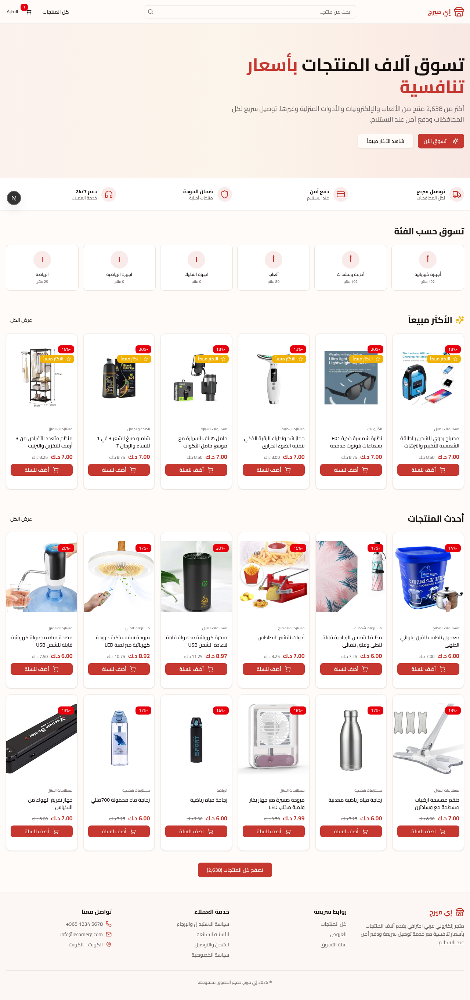 |
| *Hero Slider مُدار من اللوحة + الأكثر مبيعًا بأشرطة الخصم + التقييمات + الأكثر طلبًا في الكويت* | *فلاتر متقدمة + ترقيم 24/48/72 + شرائح اجتماعية صادقة (مبيعات/تقييمات)* |

| صفحة المنتج + Upsell | نجاح الطلب |
|:---:|:---:|
| 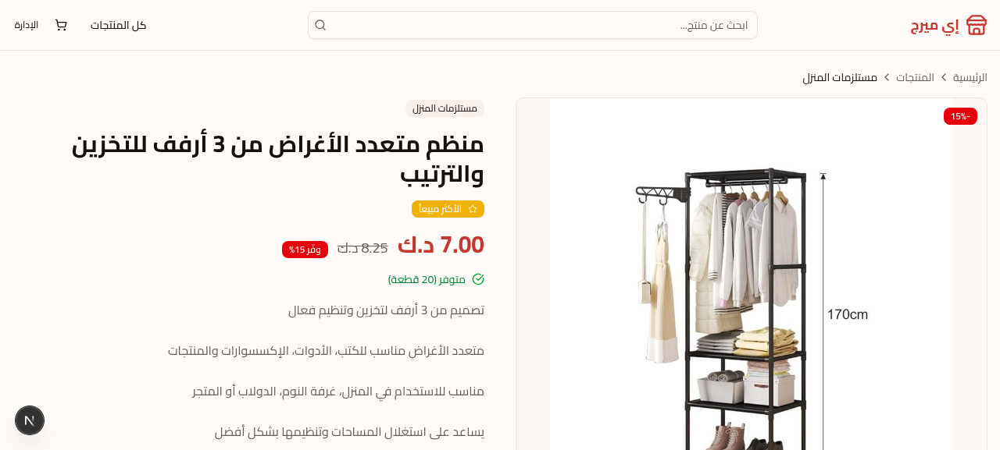 | 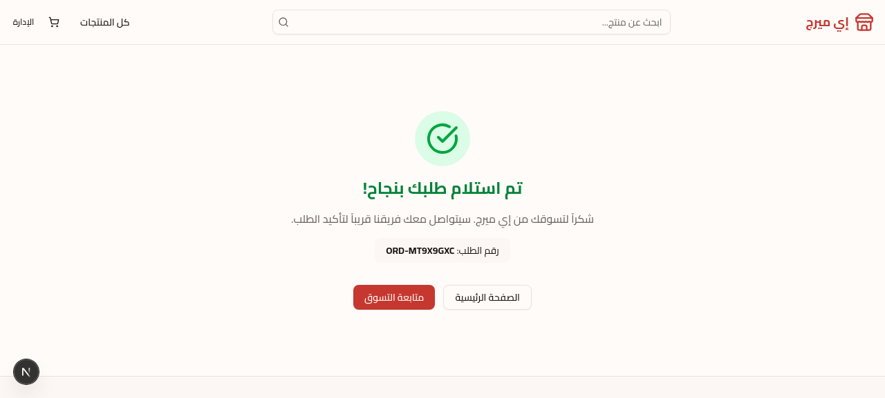 |
| *Bought-together + Upsell AI + شفافية الشحن + عداد المخزون الصادق* | *إيصال كامل + رابط تتبع تلقائي + بيانات الحساب* |

| صفحة هبوط AI | تجربة الموبايل |
|:---:|:---:|
|  | 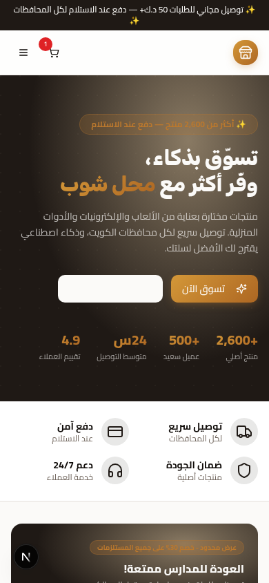 |
| *مُولّدة بالكامل بالذكاء الاصطناعي مع اختيار منتجات تلقائي* | *RTL متقن + شريط ATC لاصق + تزامن حجم المدخلات 16px* |

### لوحة التحكم (Admin Dashboard)

| إدارة المنتجات — 2,638 منتجًا | إدارة المخزون |
|:---:|:---:|
| 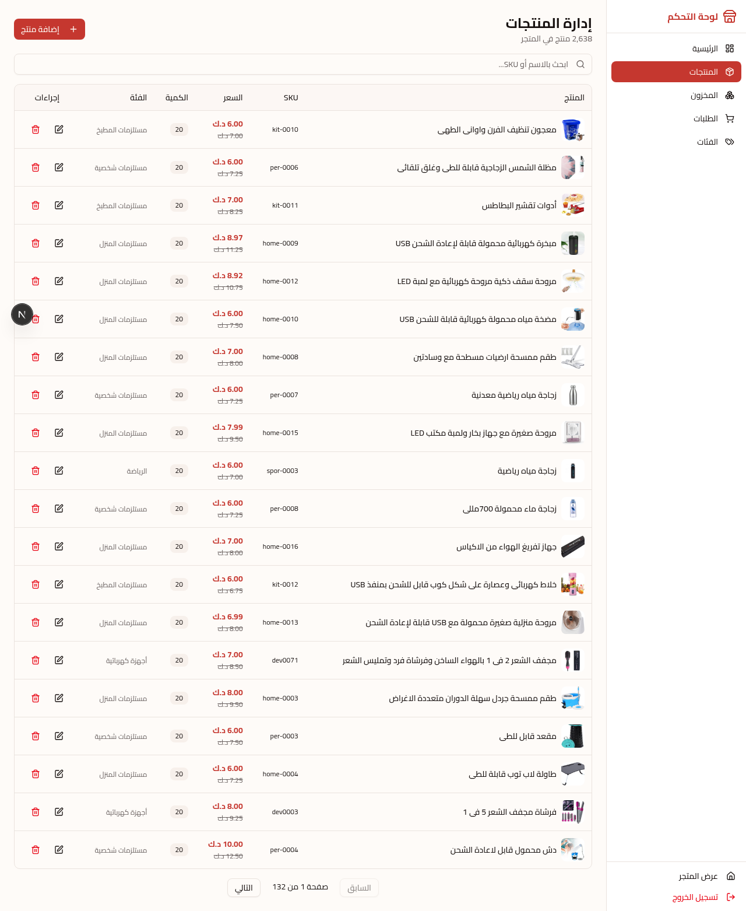 | 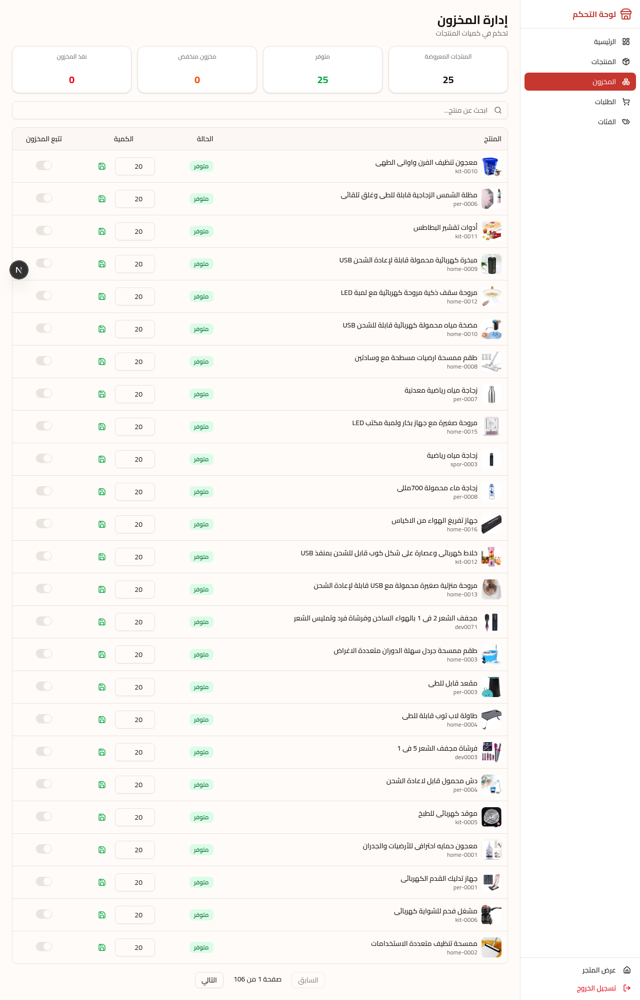 |
| *بحث فوري + ترقيم صفحات + تعديل/حذف/إضافة + تصدير XLSX* | *تتبع كميات + تنبيهات النفاد + تتبع المخزون الذكي* |

| مكتب AI بنموذج DeepSeek Thinking | إعدادات Facebook Pixel + CAPI |
|:---:|:---:|
| 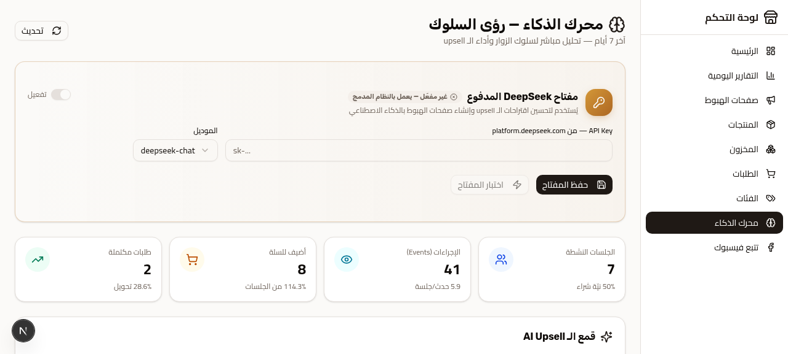 | 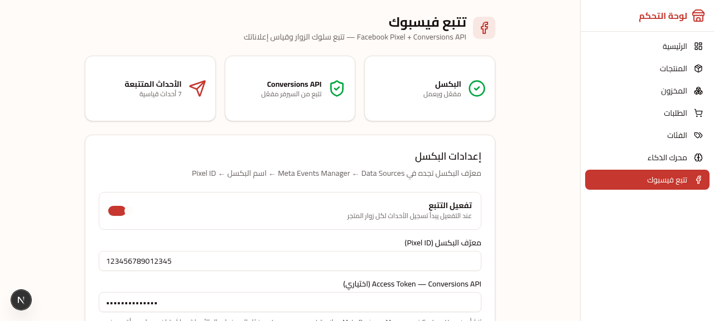 |
| *محرك إعدادات AI كامل: المفتاح، النموذج، وضع التفكير* | *Pixel + Conversions API + Test Event Code من اللوحة* |

| رؤى AI التحليلية | SEO للأجهزة المحمولة |
|:---:|:---:|
| 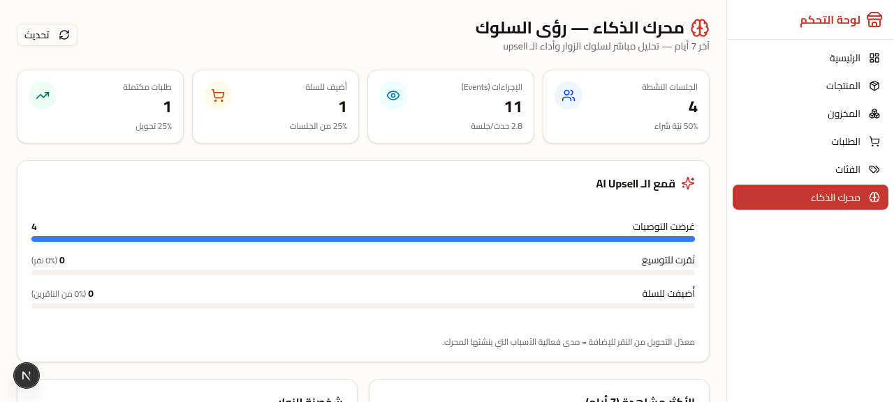 |  |
| *استنتاجات تجارية من أحداث السلوك الحقيقية* | *Metadata + JSON-LD + Open Graph مضبوطة لكل صفحة* |

---

## ✨ جدول الميزات الشامل

### 1) 🛍️ واجهة المتجر (Storefront)

| الميزة | الوصف | الحالة |
|--------|-------|:------:|
| صفحة رئيسية ديناميكية | Hero Slider + الأكثر مبيعًا + الأكثر طلبًا في الكويت/الخليج (Top-100 بترتيب بحثي موثق) + الفئات | ✅ |
| سلايدر بمستوى عالمي | تشغيل تلقائي 5-7 ثوانٍ يتوقف نهائيًا عند أول تفاعل (Baymard #3) + زر إيقاف WCAG 2.2.2 + تنقل keyboard بوعي اتجاه RTL + `fetchPriority=high` لتحسين LCP + خلفية scrim تتبع جهة النص | ✅ |
| صفحة منتج غنية | معرض صور + عداد مشاهدات حية (آخر 24 ساعة من أحداث حقيقية) + شارة الترتيب #N + عداد مبيعات صادق + صندوق شفافية الشحن | ✅ |
| بحث Autocomplete | debounce‏ 220ms + اقتراحات (6 منتجات + 3 فئات) بصور وأسعار وشارة الأكثر مبيعًا + تنقل لوحة مفاتيح + بحث حديث/شائع + إلغاء الطلبات القديمة | ✅ |
| سلة ودرج جانبي | سلة كاملة + درج سريع + شريط تقدم الشحن المجاني («أضف X د.ك واحصل على شحن مجاني») + حفظ عبر التحديث `/?cart=1` | ✅ |
| Checkout محصّن | تسعير server-side + تحقق هاتف كويتي + قائمة محافظات + حماية تكرار الطلب + خصم مخزون + التقاط UTM | ✅ |
| تتبع طلب | بحث برقم الطلب + الهاتف مع تعبئة تلقائية Deep-Link من وكيل AI + حالات الشحن والتسليم | ✅ |
| حسابات العملاء | تسجيل/دخول بالهاتف (كلمة المرور الافتراضية = الهاتف) + سجل طلبات + إدارة بيانات | ✅ |
| قائمة الرغبات | حفظ دائم Zustand persist + إضافة سريعة للسلة | ✅ |
| مُحوّل لغة | AR ⇄ EN من الهيدر (ديسكتوب + موبايل) مع مزامنة `<html dir/lang>` وscript ما قبل الرسم يمنع وميض RTL | ✅ |
| أدوات تحويل (Conversion Stack) | Exit-Intent (ماوس أعلى/سكرول سريع عكسي) + Recently Viewed + مشاهدين أحياء + Sticky Mobile ATC + Free Shipping Bar | ✅ |
| صفحات معلومات | عن المتجر/تواصل/الشحن/الإرجاع/الأسئلة الشائعة/الخصوصية/الشروط — ثنائية اللغة كاملة | ✅ |
| حدود أخطاء متينة | Error Boundary جذر + لكل View مع بطاقة استرجاع ودودة (لا انهيار كامل أبدًا) | ✅ |

### 2) 🤖 وكيل المبيعات بالذكاء الاصطناعي (`/api/ai/agent`)

| القدرة | التفاصيل التقنية |
|--------|------------------|
| بروتوكول Stateless | المسودة (Draft) تسافر مع العميل؛ الخادم يعيد التحقق من كل شيء كل دورة — لا حالة خادم قابل للعبث |
| بحث كتالوج ذكي | جلب ثنائي الطور (تطابق الاسم لا يزاحم وصف المنتج) + ترجيح نُدرة التوكن IDF («عطر» تتفوق على «شحن») + مطابقة حدود الكلمات العربية (عطر ≠ معطر) + تجريد أرقام الهواتف + تعزيز الفئات + كلمات توقف باللهجة الكويتية |
| استخراج هجين | طبقة Regex حتمية **تعمل دائمًا** (هاتف/اسم/محافظة/عنوان مع تنظيف NAME_STOP) تُدمج مع مخرجات LLM JSON — ما يفوته النموذج تكملها الطبقة الحتمية |
| عزم شراء حتمي | إضافة تلقائية للمنتج عند نيّة واضحة (≥ تطابق كلمتي اسم) + «أبغيه» يُحلّ إلى آخر منتج معروض `lastOfferedIds` |
| بوابة تأكيد مزدوجة | لا طلب إلا بـ: أمر صريح من النموذج `place_order` **أو** مسودة مكتملة + تأكيد العميل |
| 🛡️ درع الصدق (Honesty Shield) | كشف ادعاءات النجاح الكاذبة («تم تأكيد طلبك» بلا طلب) → إصلاح ذاتي للمسودة → إصدار الطلب **الحقيقي** → استبدال الرد بالإيصال الفعلي، أو طلب الحقول الناقصة بصدق |
| إيصال متكامل | رقم الطلب + الإجمالي + بيانات دخول الحساب (الهاتف = كلمة المرور) + سياسة الشحن + تعليمات تتبع + زر تتبع Deep-Link يعبّئ ويفحص تلقائيًا |
| نَفَس تجاري | شخصية «مندوب محل» + كارت طلب قيد التجهيز بحذف عنصر + اقتراح «أبي أسجل طلب» — ثنائي اللغة |

### 3) 🧠 محركات التوصية والذكاء الاصطناعي

| الخدمة | المسار | المنطق |
|--------|--------|--------|
| Upsell Engine | `/api/ai/upsell` | تقييم نية الشراء 0..1 + طبقة ميزانية (low/mid/high/premium) + ذاكرة عرض UPSell مع صلاحية انتهاء + تحليلات نقر/إضافة |
| Bought-together | `/api/products/bought-together` | أولوية أمازونية: شراء مشترك ← مشاهدة مشتركة ← أفضل مبيعات نفس الفئة، مع **استبعاد محتويات السلة والمخزون النافد دائمًا** وشارات مصدر صادقة |
| رؤى AI Insights | `/api/ai/insights` | استنتاجات تجارية من أحداث السلوك الحقيقية (12 نوع حدث) |
| شات الدعم | `/api/ai/chat` | إجابات دعم ثنائية اللغة بنفس طبقة المزودين المتدرجة |
| توليد صفحات الهبوط | `/api/admin/landing/generate` | تنقيب كلمات الموضوع (إزالة stopwords عربية) + ترتيب المنتجات المطابقة المتاحة → 6 منتجات مختارة تلقائيًا + ثيم + أقسام + FAQ |
| كاتب السلايدر | `/api/admin/slider/generate` + `/auto` | نسخة لكل شريحة من معرّف المنتج أو موضوع حر، أو سلايدر منتجات كامل: ترتيب بـ 4 استراتيجيات + تنويع فئات + استدعاء AI واحد للكل، معاينة قبل التطبيق |
| مكتب Top-100 | `/api/admin/top100` | DeepSeek v4 Thinking مع `reasoning_effort=low` (تشخيص: 8000 توكن تفكير كان يُفرغ الرد) + إعادة محاولة واحدة (4/4 نجاح) + فرق عرض (الحالي مقابل المقترح) قبل النشر |

> **سياسة الصدق في المحتوى (Honest-Copy Policy):** كل برومبتات AI في المنصة مقيّدة بعدم اختلاق أرقام أو مواعيد أو وعود — الأسعار والحقائق من قاعدة البيانات فقط، و`aggregateRating` في JSON-LD لا يُصدَر إطلاقًا دون تقييمات معتمدة حقيقية.

### 4) ⭐ نظام التقييمات والمُذكرات الاجتماعية

| الميزة | الوصف |
|--------|-------|
| تقييمات موثقة | مطابقة الهاتف ضد طلبات حقيقية غير الملغاة → شارة «مشتري موثق» + نشر تلقائي؛ غير الموثق ينتظر موافقة الإدارة |
| تعديل إداري | تبويبات (قيد المراجعة/معتمد) + بحث + موافقة/رفض/توثيق/حذف مع صورة المنتج |
| تصويت مفيد | عدّاد helpfulCount ببصمة IP خفيفة |
| تجربة عرض | ملخص نجوم + أشرطة توزيع + قناع الاسم الأول + «منذ X» + ترقيم مرقّم 7/صفحة بمعيار أمازون (نافذة 1 … n) |
| حمايات | حد 5 تقييمات/ساعة/IP + منع تكرار + توحيد صيغة الهاتف الكويتي |
| إثبات اجتماعي صادق | عدّاد «🔥 طُلب X مرة» (أساس + طلبات حقيقية) + شارة ندرة مخزون صادقة ≤5 قطع |

### 5) 🎛️ لوحة تحكم الإدارة (17+ شاشة)

| الشاشة | القدرات |
|--------|---------|
| لوحة القيادة | مؤشرات الأداء المجمعة من `/api/admin/stats` |
| المنتجات | 2,638 صفًا: بحث + ترقيم + CRUD كامل + **تصدير XLSX** + استيراد بصيغة EasyOrder/Ecomerg |
| المخزون | كميات + تتبع مخزون لكل منتج + حالات النفاد |
| الطلبات | متابعة الحالات + تعديل الحالة + تفاصيل UTM والهبوط لكل طلب |
| التقييمات | الموديريشن الكامل (أعلاه) |
| الفئات | شجرة فئات هرمية مع ترجمة إنجليزية |
| التقارير | تقارير المبيعات والأداء |
| الرؤى AI | لوحة استنتاجات الأعمال |
| السلايدر | **WYSIWYG** ثنائي اللغة: معاينة مطابقة 1:1 للمتجر + ترتيب/تكرار/حذف + صورة URL/رفع ≤600KB/صورة منتج + ربط CTA (متجر/فئة/هبوط/تتبع/منتج) + شارة اكتمال EN |
| صفحات الهبوط | توليد AI + تفعيل + تمييز + عداد مشاهدات |
| الأكثر طلبًا Top-100 | قائمة مرتبة (#1 ذهبي) + إحصائيات التغطية + مكتب تحرير AI بفرق النسخ |
| SEO | إعدادات الـ SEO العامة من اللوحة |
| فيسبوك | Pixel ID + Access Token + Test Event Code — بلا لمسة كود |
| GA4 | ربط قياس Google Analytics 4 |
| الهوية | اسم المتجر واللوجو والهوية |
| الشحن | سياسة الشحن المجاني والعناوين الموعودة |
| إعدادات AI | مفتاح DeepSeek المدفوع + اختيار النموذج + معرّفات مخصصة مستقبلية |

### 6) 📊 التتبع السلوكي والتحليلات

| الطبقة | التفاصيل |
|--------|----------|
| أحداث سلوكية | **12 نوعًا**: `page_view, product_view, search, add_to_cart, remove_from_cart, cart_open, checkout_start, checkout_complete, upsell_shown, upsell_clicked, upsell_added, filter_apply` |
| ملف الجلسة | `visitorId` مستقر + ربط اختياري بالعميل + **Persona** مستنتجة (bargain_hunter/gadget_lover/…) + **Intent Score** 0..1 + **Budget Tier** |
| Facebook CAPI | أحداث خادم→خادم مع تشويش هاش + Test Event Code — من `/api/track/facebook` |
| GA4 | أحداث تجارة إلكترونية موحدة |
| إسناد الإعلانات | كل طلب يُحفظ مع `utm_source/medium/campaign/term/content` + `landingPath` صفحة الهبوط الأولى |

### 7) 🔍 SEO وGEO (تحسين محركات البحث + محركات التوليد)

| الميزة | الوصف |
|--------|-------|
| JSON-LD كامل | Product + Offer + **aggregateRating فقط بتقييمات حقيقية معتمدة** + BreadcrumbList |
| Sitemap + Robots | توليد آلي `sitemap.ts` + `robots.ts` |
| llms.txt + llms-full.txt | مساران جاهزان لمحركات التوليد (GEO) لفهرسة الكتالوج |
| Open Graph + Canonical | لكل صفحة عبر `NEXT_PUBLIC_SITE_URL` + favicon ديناميكي |
| Deep-Links | روابط منتجات `/?p=slug` مع Metadata noindex صحيحة للسلة/الدفع |

### 8) 🌐 التدويل (i18n) — عربي/إنجليزي كامل

| الميزة | الوصف |
|--------|-------|
| قاموس مركزي | ~380 مفتاحًا في `src/lib/i18n.ts` + خطاف `useT()` + نسخة خادم `i18n-server.ts` |
| RTL/LTR حقيقيان | مزامنة `dir` + `lang` على `<html>` + سكربت ما قبل الرسم يمنع الوميض + مكونات واعية للاتجاه (سلايدر، أسهم، scrim) |
| ترجمة الكتالوج | 2,638/2,638 منتجًا مترجمة AI (اسم + وصف) مع سقوط آمن إلى العربية عند نقص الترجمة |
| APIs واعية للغة | `?lang=en` على: المنتجات/التفاصيل/Top-Demand/الفئات/الأكثر مبيعًا/الاقتراحات/الشات |
| محتوى ثنائي | كل صفحات المعلومات والـ FAQ بمحتوى مزدوج كامل (لا ترجمة آلية للواجهة) |

### 9) 🔐 الأمان والمتانة

| الطبقة | التنفيذ |
|--------|---------|
| رؤوس OWASP | `X-Content-Type-Options` + `X-Frame-Options: SAMEORIGIN` + `Referrer-Policy` + `Permissions-Policy` (إطفاء كاميرا/مايك/جيولوكيشن) + إطفاء `X-Powered-By` |
| كلمات المرور | bcryptjs — لا نص صريح أبدًا؛ جلسات أدمن موقعة |
| حدود المعدل | 5 تقييمات/ساعة/IP + حارس تكرار |
| تسعير الخادم | الإجماليات تُحسب دائمًا في الخادم (`create-order.ts`) — لا يثق بالعميل |
| قوائم بيضاء | المحافظات + طرق الدفع من تعريفات خادم |
| حماية تكرار | كشف الطلبات المزدوجة بنفس السلة |
| I18N persistence | إصلاح ثغرة localStorage الخام التي كانت تُسقط وضع EN للزوار العائدين |

---

## 🏗️ المعمارية التقنية

### حزمة التقنيات (النسخ الفعلية من `package.json`)

| الطبقة | التقنية | النسخة | الدور |
|--------|---------|:------:|-------|
| Framework | **Next.js** (App Router, Standalone) | `16.1.1` | SSR + 51 API Route + Metadata API |
| UI Runtime | **React** | `19` | Server/Client Components |
| اللغة | **TypeScript** | `5.x` | تضييق أنواع دقيق عبر كل المكوّنات |
| Styling | **Tailwind CSS** + tw-animate | `4` | Design Tokens + RTL utilities |
| Design System | **shadcn/ui** فوق Radix | 48 مكوّنًا | UI Primitives متاحة الوصول |
| ORM | **Prisma** | `6.11.1` | 12 نموذجًا + فهارس مركبة |
| قاعدة البيانات | **PostgreSQL — Neon Serverless** | — | Pooler للتطبيق + Direct للمهاجرات |
| إدارة الحالة | **Zustand** (persist) | `5` | 4 متاجر: cart / app / lang / wishlist |
| جلب البيانات | **TanStack Query + Table** | `5 / 8` | ذاكرة خادم + جداول إدارية |
| الرسوم | **Recharts** | `2.15` | رسوم لوحة التحكم والتقارير |
| الحركة | **Framer Motion** | `12` | انتقالات وحركات مكوّنات |
| الذكاء الاصطناعي | **DeepSeek API** + Z-AI SDK | — | chat + reasoner (v4 Thinking) |
| المصادقة | **bcryptjs** + جلسات موقعة | `3` | أدمن + عملاء |
| الوسائط | **sharp** | `0.34` | معالجة الصور |
| الجداول | **xlsx** | `0.18` | تصدير/استيراد المنتجات |
| التحقق | **Zod** | `4` | تحقق مخططات الـ APIs |
| بيئة التشغيل | **Bun** (أو Node) | `1.3+` | dev + standalone production server |

### المخطط المعماري العام

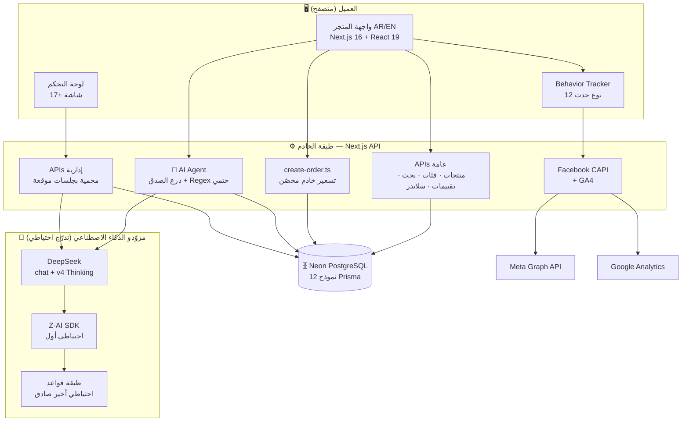

### دورة حياة طلب عبر وكيل الذكاء الاصطناعي

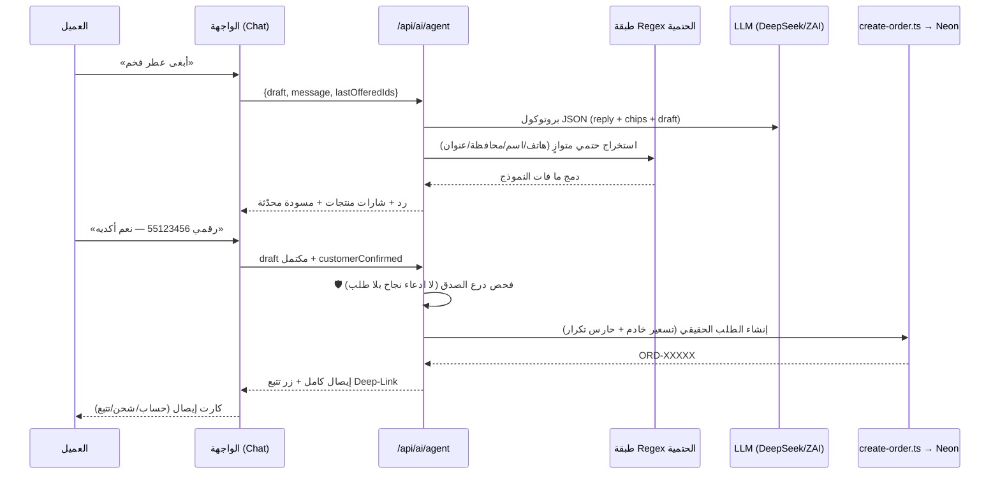

---

## 🗄️ نماذج قاعدة البيانات

12 نموذجًا في `prisma/schema.prisma` (PostgreSQL / Neon) بفهارس مركبة مدروسة:

| النموذج | الغرض | أبرز الحقول الذكية |
|---------|-------|---------------------|
| `Category` | شجرة فئات هرمية | `nameEn` ترجمة + self-relation أب/أبناء + `slug` فريد |
| `Product` | الكتالوج (2,638) | `demandRank` 1..100 بحثي + `soldCount` اجتماعي صادق + `nameEn/descriptionEn` + سياسات مخزون لكل منتج + 4 فهارس |
| `Review` | التقييمات (53K) | `isVerified` مطابقة طلبات خادم + `isApproved` موديريشن + `helpfulCount` + فهرس مركب `(productId, isApproved)` |
| `Customer` | العملاء | هاتف معرّف + `passwordHash` bcrypt (الافتراضي = الهاتف) |
| `Order` | الطلبات | رقم فريد `ORD-*` + **حزمة إسناد كاملة**: 5 حقول UTM + `landingPath` + مواعيد شحن/تسليم + `arrivalNote` موعود بشري |
| `OrderItem` | عناصر الطلب | لقطة السعر/الاسم/الصورة لحظة الشراء (مقاومة لتعديل الكتالوج) |
| `AdminUser` | الإداريون | أدوار: owner / admin / staff |
| `SiteSetting` | إعدادات الموقع | مخزن Key/Value JSON: بكسل فيسبوك، DeepSeek، الشحن، السلايدر… |
| `LandingPage` | صفحات الهبوط AI | محتوى JSON (أقسام/FAQ/ثيم) + منتجات مختارة + تفعيل/تمييز + عداد مشاهدات |
| `UserSession` | جلسات السلوك | `visitorId` مستقر + `persona` + `intentScore` 0..1 + `budgetTier` |
| `UserEvent` | الأحداث (12 نوعًا) | Enum `EventType` + metadata JSON + فهارس `(sessionId, createdAt)` و`(type)` |
| `UpsellOffer` | ذاكرة التوصيات | payload مخزّن + `modelVersion` لإبطال كاش + تتبع `clicked/added` + `expiresAt` |

### شجرة الكود المصدري (`src/`)

```text
src/
├── app/
│   ├── api/                      # 51 مسارًا (مرجع كامل أدناه)
│   │   ├── admin/                # 16 مجموعة إدارية محمية
│   │   ├── ai/                   # agent · chat · insights · upsell
│   │   ├── cron/autoship/        # شحن تلقائي يومي 10:00 بتوقيت الكويت
│   │   ├── customer/             # تسجيل · دخول · بياناتي · طلباتي
│   │   ├── products/             # قائمة · [slug] · top-demand · bought-together
│   │   ├── orders/               # إنشاء + تتبع
│   │   ├── reviews/  search/  settings/  track/
│   │   └── health/  favicon/  landing/  best-sellers/  categories/
│   ├── layout.tsx  page.tsx  error.tsx   # جذر التطبيق + حدود الأخطاء
│   ├── sitemap.ts  robots.ts  manifest.ts
│   ├── llms.txt/  llms-full.txt/         # GEO لمحركات التوليد
│   └── globals.css                        # Design Tokens + قواعد RTL/موبايل
├── components/
│   ├── store/    (29 مكوّنًا)    # كل أسطح المتجر + Widgets
│   ├── admin/    (17+ شاشة)     # لوحة التحكم + slider/ subcomponents
│   └── ui/       (48 مكوّنًا)    # shadcn/ui primitives
├── lib/
│   ├── ai/                       # upsell.ts · bought-together.ts
│   ├── stores/                   # cart · app · lang · wishlist (Zustand)
│   ├── create-order.ts           # 🛡️ منطق الطلب المحصّن المشترك
│   ├── deepseek.ts               # عميل AI متدرج + reasoning_effort
│   ├── behavior-tracker.ts       # محرك الأحداث السلوكية
│   ├── facebook-pixel.ts  ga4.ts # التتبع التسويقي
│   ├── seo.ts  site-identity.ts  # SEO + الهوية
│   ├── i18n.ts  i18n-server.ts   # ~380 مفتاحًا
│   ├── kw-phone.ts               # تحقق/توحيد الهاتف الكويتي
│   ├── auth.ts  customer-auth.ts # جلسات موقعة
│   ├── auto-ship.ts              # وظيفة الشحن التلقائي
│   └── slider-settings.ts  slider-types.ts  settings.ts  utm.ts
└── hooks/                        # use-mobile · use-toast
```

---

## 🔌 مرجع API الكامل — 51 مسارًا

> جميع الطرق أدناه مستخرجة آليًا من الكود الفعلي (`export async function GET|POST|PUT|PATCH|DELETE`). المسارات الإدارية تتطلب جلسة أدمن موقعة عبر `Authorization` header.

### 🛍️ الكتالوج والبحث (عامة — لا مصادقة)

| الطريقة | المسار | الوظيفة |
|:-------:|--------|---------|
| `GET` | `/api/products` | قائمة المنتجات: ترقيم + فلترة فئة + ترتيب (يتضمن الأكثر مبيعًا) + `?lang=en` |
| `GET` | `/api/products/[slug]` | تفاصيل منتج + تقييمات مجمعة + منتجات ذات صلة بترتيب المبيعات |
| `GET` | `/api/products/top-demand` | ترتيب Top-100 للأكثر طلبًا (درجات كلمات بحثية + تعزيزات) — كاش 5 دقائق + CDN 300s |
| `GET` | `/api/products/bought-together` | توصيات الشراء المشترك (شراء > مشاهدة > فئة) مع استبعاد السلة والنافد |
| `GET` | `/api/best-sellers` | قائمة الأكثر مبيعًا |
| `GET` | `/api/categories` | شجرة الفئات + `?lang=en` |
| `GET` | `/api/search/suggest` | اقتراحات فورية: 6 منتجات + 3 فئات — مايكرو-كاش بادئات 60s |
| `GET` | `/api/landing` | صفحات الهبوط النشطة/المميزة |
| `GET` | `/api/health` | فحص صحة النظام (DevOps) |
| `GET` | `/api/favicon` | أيقونة الموقع ديناميكية من الهوية |
| `GET` | `/api` | جذر الـ API — حالة |

### 🤖 الذكاء الاصطناعي

| الطريقة | المسار | الوظيفة |
|:-------:|--------|---------|
| `POST` | `/api/ai/agent` | **وكيل المبيعات**: بحث كتالوج + مسودة طلب + درع صدق + إصدار طلب حقيقي |
| `POST` | `/api/ai/chat` | شات الدعم ثنائي اللغة |
| `GET` | `/api/ai/insights` | رؤى الأعمال من أحداث السلوك |
| `GET` `POST` | `/api/ai/upsell` | محرك Upsell: GET للعرض المخزّن، POST للتوليد + تسجيل نقر/إضافة |

### 📦 الطلبات والعملاء

| الطريقة | المسار | الوظيفة |
|:-------:|--------|---------|
| `POST` `GET` | `/api/orders` | إنشاء طلب (تسعير خادم + حارس تكرار + UTM) + استعلامات إدارية |
| `POST` | `/api/orders/track` | تتبع طلب برقم الطلب + الهاتف |
| `POST` | `/api/customer/register` | تسجيل عميل (الهاتف = كلمة مرور افتراضية bcrypt) |
| `POST` | `/api/customer/login` | دخول عميل |
| `GET` `PUT` | `/api/customer/me` | بيانات العميل + تحديثها |
| `GET` | `/api/customer/orders` | سجل طلبات العميل |

### ⭐ التقييمات والتتبع

| الطريقة | المسار | الوظيفة |
|:-------:|--------|---------|
| `GET` `POST` | `/api/reviews` | GET: ملخص + توزيع + ترقيم 7/صفحة (كاش 60s) · POST: إضافة بحد 5/ساعة/IP + توثيق تلقائي بالهاتف |
| `POST` `GET` | `/api/track` | استقبال الأحداث السلوكية (12 نوعًا) + تحديث الجلسة/الشخصية |
| `POST` | `/api/track/facebook` | أحداث Conversions API خادم→ميتا |

### ⚙️ الإعدادات العامة (عينة الواجهة)

| الطريقة | المسار | الوظيفة |
|:-------:|--------|---------|
| `GET` | `/api/settings/slider` | شرائح الهيرو المُدارة (force-dynamic لفورية الحفظ) |
| `GET` | `/api/settings/shipping` | سياسة الشحن (حد المجاني + الرسوم + المواعيد) |
| `GET` | `/api/settings/brand` | هوية المتجر (الاسم/اللوجو/التواصل) |
| `GET` | `/api/settings/facebook` | تفعيل البكسل للواجهة (المعرّف فقط — لا توكن) |
| `GET` | `/api/settings/ga4` | معرّف قياس GA4 للواجهة |

### 🔐 الإدارة (محمية بجلسة أدمن)

| الطريقة | المسار | الوظيفة |
|:-------:|--------|---------|
| `POST` `GET` | `/api/admin/login` | دخول أدمن + التحقق من الجلسة |
| `GET` | `/api/admin/stats` | مؤشرات لوحة القيادة |
| `GET` | `/api/admin/reports` | التقارير التحليلية |
| `GET` `POST` | `/api/admin/products` | قائمة إدارية كاملة + إنشاء |
| `GET` `PUT` `DELETE` | `/api/admin/products/[id]` | قراءة/تحديث/حذف منتج |
| `GET` | `/api/admin/products/export` | تصدير XLSX |
| `PATCH` | `/api/admin/orders/[id]` | تحديث حالة الطلب |
| `GET` `POST` | `/api/admin/categories` | إدارة شجرة الفئات |
| `GET` `PATCH` `DELETE` | `/api/admin/reviews` | موديريشن: موافقة/رفض/توثيق/حذف + إحصائيات |
| `GET` `POST` `PUT` | `/api/admin/landing` | إدارة صفحات الهبوط |
| `POST` | `/api/admin/landing/generate` | توليد صفحة هبوط AI مع اختيار منتجات تلقائي |
| `GET` `PUT` `DELETE` | `/api/admin/slider` | حفظ ذري للشرائح + إعادة ضبط للافتراضي |
| `POST` | `/api/admin/slider/generate` | كاتب نصوص شريحة (منتج/موضوع) AR+EN معًا |
| `POST` | `/api/admin/slider/auto` | سلايدر منتجات ديناميكي بنداء AI واحد |
| `GET` `POST` | `/api/admin/top100` | قائمة الأكثر طلبًا + مكتب تحرير DeepSeek Thinking |
| `GET` `PUT` `POST` | `/api/admin/ai-settings` | مفتاح/نموذج/تفعيل DeepSeek |
| `GET` `PUT` | `/api/admin/facebook` | بكسل + CAPI توكن + كود اختبار |
| `GET` `PUT` | `/api/admin/ga4` | إعدادات القياس |
| `GET` `PUT` | `/api/admin/identity` | هوية المتجر |
| `GET` `PUT` | `/api/admin/seo` | إعدادات SEO |
| `GET` `PUT` | `/api/admin/shipping` | سياسة الشحن |

### ⏰ المهام الدورية (Cron)

| الطريقة | المسار | الوظيفة |
|:-------:|--------|---------|
| `GET` | `/api/cron/autoship` | شحن تلقائي يومي 10:00 بتوقيت الكويت — يحدّث `shippedAt` + `arrivalNote` عبر `auto-ship.ts` (جدولة عبر Vercel Cron) |

---

## ⚡ دليل الإعداد الكامل

### المتطلبات

| الأداة | الحد الأدنى | ملاحظات |
|--------|:-----------:|---------|
| [Bun](https://bun.sh) أو Node.js | `1.3+` / `20+` | Bun مستخدم في أوامر الإنتاج (`bun.lock` مرفق) |
| قاعدة بيانات PostgreSQL | — | يُنصح بـ [Neon Serverless](https://neon.tech) (خطة مجانية تكفي) |
| مفتاح DeepSeek (اختياري) | — | للـ AI الكامل — يعمل بدون مفتاح بوضع احتياطي صادق عبر Z-AI SDK |

### خطوات التشغيل

```bash
# 1) استنساخ المستودع
git clone https://github.com/ahmedezzatelsayad/Mahhl.git
cd Mahhl

# 2) تثبيت الحزم
bun install          # أو: npm install

# 3) إعداد البيئة
cp .env.example .env # ثم املأ القيم (الجدول التالي)

# 4) توليد عميل Prisma + دفع السكيما لقاعدة البيانات
bun run db:generate
bun run db:push

# 5) (اختياري) تغذية بيانات أولية
bunx tsx scripts/seed-products.ts          # كتالوج
bunx tsx scripts/seed-kuwaiti-reviews.js   # تقييمات كويتية واقعية
bunx tsx scripts/seed-phase2-sold-demand.js # مزامنة المبيعات والترتيب

# 6) التطوير
bun run dev          # http://localhost:3000

# 7) الإنتاج محليًا
bun run build
bun start
```

### متغيرات البيئة (`.env`)

| المتغير | إلزامي؟ | الوصف |
|---------|:-------:|-------|
| `NEON_DATABASE_URL` | ✅ | اتصال Pooler لـ Neon PostgreSQL (`sslmode=require&channel_binding=require`) |
| `DIRECT_URL` | ✅ | اتصال مباشر (غير Pooler) للمهاجرات فقط |
| `DATABASE_URL` | ✅* | *الاسم الذي تقرأه `schema.prisma` — ساويه بقيمة `NEON_DATABASE_URL` |
| `FOUNDER_EMAIL` | ✅ | حساب الفاوندر/الأدمن (يُزرع تلقائيًا عند أول تشغيل) |
| `FOUNDER_PASSWORD` | ✅ | كلمة مرور الأدمن — **غيّرها فورًا** |
| `ZAI_API_KEY` | ➖ | مزود AI الاحتياطي (يُقرأ تلقائيًا داخل بيئة workspace) |
| `FB_PIXEL_ID` | ➖ | معرّف البكسل من Meta Events Manager (أو اضبطه من اللوحة) |
| `FB_ACCESS_TOKEN` | ➖ | توكن System User بصلاحية `ads_management` لـ CAPI |
| `FB_TEST_EVENT_CODE` | ➖ | كود اختبار الأحداث (أثناء التطوير فقط) |
| `NEXT_PUBLIC_SITE_URL` | ➖ | رابط الدومين الرسمي — canonical + sitemap + llms.txt |

### أوامر `package.json`

| الأمر | الوظيفة |
|-------|---------|
| `bun run dev` | خادم تطوير على منفذ 3000 مع سجل `dev.log` |
| `bun run build` | بناء إنتاج Standalone + نسخ static/public |
| `bun start` | تشغيل خادم الإنتاج عبر Bun |
| `bun run lint` | فحص ESLint |
| `bun run db:push` | دفع السكيما لقاعدة البيانات |
| `bun run db:generate` | توليد عميل Prisma |
| `bun run db:migrate` / `db:reset` | مهاجرات dev / تصفير |

---

## 🚀 النشر على الإنتاج (Vercel + Neon)

1. **قاعدة البيانات**: أنشئ مشروعًا على [Neon](https://neon.tech) ← انسخ `Pooler Connection` و`Direct Connection`.
2. **Vercel**: استورد المستودع ← اربطه تلقائيًا (`vercel.json` غير مطلوب — Next.js 16 يُكتشف فورًا).
3. **Environment Variables**: أضف كل متغيرات الجدول أعلاه في Vercel → Settings → Environment Variables.
4. **Prisma على Vercel**: `prisma generate` يعمل ضمن `build` تلقائيًا؛ `DIRECT_URL` ضروري للـ migrate.
5. **Cron الشحن التلقائي**: أضف في `vercel.json` جدولة `/api/cron/autoship` يوميًا 07:00 UTC (= 10:00 بتوقيت الكويت).
6. **⚠️ Deployment Protection**: اجعلها `Public/Disabled` — Vercel → Settings → Deployment Protection. (إلا سيحول Vercel كل الزوار العموميين إلى صفحة تسجيل دخول).
7. **الدومين**: أضف دومينك وحدّث `NEXT_PUBLIC_SITE_URL`.

> **فحص ما بعد النشر**: `GET /api/health` يجب أن يعيد `{ ok: true }` — ثم افتح المتجر وجرّب وكيل AI بجملة كويتية: «أبغى عطر».

---

## 🧰 أدوات السكربتات والأداء والجودة

### أهم سكربتات `scripts/`

| السكربت | الوظيفة |
|---------|---------|
| `seed-products.ts` | تغذية الكتالوج الكامل |
| `seed-kuwaiti-reviews.js` | توليد 53K تقييم كويتي واقعي (أسماء + لهجة حسب فئة المنتج) — قابل لإعادة التشغيل بلا مساس بالتقييمات الحقيقية (`seedrv` prefix) |
| `seed-phase2-sold-demand.js` | مزامنة `soldCount` + حساب `demandRank` من أطياف الكلمات البحثية |
| `translate-products.js` | ترجمة المنتجات للإنجليزية — Idempotent + واعٍ بحد 429 + استكمال ذاتي |
| `migrate-sqlite-to-neon.ts` | ترحيل قاعدة SQLite المحلية إلى Neon |
| `backfill-slider-en.ts` | تعبئة نصوص EN الناقصة للسلايدر (Idempotent) |
| `scrape_products.py` + `scrape_all_images.py` | أدوات تجميع كتالوج وصور |
| `build_easyorder_xlsx.py` | بناء ملفات استيراد بصيغة EasyOrder |
| `e2e-orders-test.ts` | اختبار E2E لدورة الطلبات الكاملة |
| `cleanup-test-orders.ts` + `cleanup-test-reviews.js` | تنظيف بيانات الاختبار من الإنتاج (سياسة محتوى نظيف) |

### طبقات التخزين المؤقت (Caching Strategy)

| الطبقة | النطاق | المدة |
|--------|--------|:-----:|
| CDN (`s-maxage` + SWR) | APIs الكتالوج العامة | 60-300s |
| In-Memory (للكائن) | التقييمات `slug#page` 60s · اقتراحات البادئة 60s · Top-Demand 5 دقائق · السلايدر 45s | متغير |
| Static Immutable | `_next/static/**` | سنة كاملة |
| Force-Dynamic | إعدادات مُدارة من اللوحة (سلايدر/شحن) — فورية بلا تخلّف | — |

### معايير الجودة المُطبقة (بمصادر موثقة)

| المعيار | التطبيق العملي |
|---------|----------------|
| **Baymard Institute** | شفافية الشحن قبل الدفع (سبب #1 للتخلي 70.19%) + Sticky Mobile ATC + حفظ السلة عبر التحديث |
| **Nielsen Norman Group** | سلايدر ≤5 شرائح + توقف نهائي عند التفاعل + تحكم إيقاف ظاهر |
| **WCAG 2.2.2** | pause/play بـ `aria-pressed` + `aria-live` polite + تنقل keyboard + دعم `prefers-reduced-motion` |
| **OWASP Baseline** | رؤوس أمان + إطفاء كاشيف المعلومات + تسعير خادم + حدود معدل |
| **Core Web Vitals** | `fetchPriority=high` + preload للشريحة الأولى + صور محسّنة sharp |
| **Honest Commerce** | لا `aggregateRating` بلا تقييمات حقيقية + شارات مصدر التوصية صادقة + برومبتات AI ممنوعة من الاختلاق |

---

## ❓ الأسئلة الشائعة للمطورين (FAQ)

جمعنا هنا أكثر الأسئلة تكرارًا من مطورين يريدون تشغيل **Mahhl** محليًا أو بناء متجرهم عليه. إن لم تجد إجابتك هنا فابدأ بقسم [دليل الإعداد الكامل](#دليل-الإعداد-الكامل) ثم [مرجع API الكامل](#مرجع-api-الكامل--51-مسارا) — فمعظم الإجابات التالية هي تعميق لأمثلة موجودة هناك، وكل مسار كود مذكور أدناه حقيقي وقابل للفتح من المستودع مباشرة.

### 🔧 التشغيل والإعداد

**س: ما المتطلبات الأساسية قبل التشغيل؟**

تحتاج Node.js 20 أو أحدث وقاعدة PostgreSQL حية — والأفضل حساب [Neon](https://neon.tech) مجاني يكفي مرحلة التطوير كاملة، مع المتغيرين `NEON_DATABASE_URL` (اتصال Pooler) و`DIRECT_URL` (للمهاجرات فقط) ثم ساوية بقيمة `DATABASE_URL` التي تقرأها `schema.prisma` — التفاصيل كاملة في جدول [متغيرات البيئة](#متغيرات-البيئة-env). مفتاح DeepSeek لا يدخل عبر `.env` أصلًا: يُلصق من صفحة الذكاء الاصطناعي في لوحة التحكم فيُخزن في `SiteSetting` (بالمفتاح `deepseek`) ويتقدم تلقائيًا على مزود Z-AI المدمج، والحساب الإداري نفسه يُزرع تلقائيًا عند أول تشغيل من `FOUNDER_EMAIL` و`FOUNDER_PASSWORD`.

**س: هل يعمل المشروع بدون مفاتيح ذكاء اصطناعي إطلاقًا؟**

نعم، وهذا تصميم متعمد. كل خدمة من الخدمات التسع مبنية على سلسلة احتياط ثلاثية: DeepSeek أولًا، ثم Z-AI SDK، ثم طبقة قواعد حتمية (Regex + استدلال من بيانات البحث والفئات المحفوظة). المتجر والكتالوج والسلة والطلبات ولوحة التحكم تعمل بصفر مفاتيح؛ ما تفقده فقط هو حرية الصياغة في المحادثة، بينما تظل دورة الصرف الفعلية للطلب تعمل بنفس الدقة لأنها لا تمر عبر النموذج أصلًا.

**س: كيف أهيّئ قاعدة البيانات من الصفر؟**

بترتيب صارم: `npx prisma generate` لبناء العميل، ثم `npx prisma db push` لدفع السكيما (12 نموذجًا) إلى Neon، ثم سكربتات التغذية بالتسلسل: `seed-products.ts` للكتالوج، فـ `seed-kuwaiti-reviews.js` للتقييمات الكويتية، فـ `seed-phase2-sold-demand.js` لمزامنة عدادات الطلب والرتب. أعد تشغيل أي سكربت لاحقًا بأمان — كلها مصممة Idempotent فلا تضاعف البيانات مهما كررت التنفيذ.

**س: أين أجد المسارات وكيف أختبرها بسرعة؟**

قسم [مرجع API الكامل — 51 مسارًا](#مرجع-api-الكامل--51-مسارا) أعلاه يوثق كل مسار بطريقة HTTP الحقيقية المستخرجة من الكود نفسه، مع تقسيم مجموعات حسب الصلاحية. للاختبار الفوري: `curl` على `/api/products?limit=5` يعمل بلا مصادقة، أما مسارات `/api/admin/**` فتحتاج جلسة أدمن مسجلة عبر مسار تسجيل الدخول — الحماية جلسات وليست مفتاحًا ثابتًا في الكود، وهو نفس النموذج الذي ستحاكيه في اختباراتك.

**س: أرقام 2,638 منتجًا و53,087 تقييمًا — هل تأتي مع الكود؟**

لا؛ الكود يأتي نظيفًا بلا بيانات، وهذه أرقام قاعدة الإنتاج الفعلية للمؤلف. سكربتات التغذية تولّد لك مثيلاً مكافئًا: كتالوجًا كاملًا بترجمة إنجليزية عبر `translate-products.js`، وتقييمات بلهجة وأسماء كويتية متنوعة حسب فئة كل منتج. وإن أردت قاعدة صافية للإطلاق، فسكربتات `cleanup-test-orders.ts` و`cleanup-test-reviews.js` تنسحب بجرعة تنظيم على بيانات التجارب دون المساس بالمحتوى الحقيقي.

### 🤖 طبقة الذكاء الاصطناعي

**س: كيف يضمن وكيل المبيعات أنه لن «يهلوس» طلبًا؟**

بثلاث طبقات دفاع مستقلة: برومبت النظام يحظر اختلاق أسماء منتجات أو أسعار صراحةً، فطبقة الاستخراج الحتمية بالـ Regex تلتقط تفاصيل الطلب (المنتج، الكمية، اللون، العنوان، الهاتف) من نص المحادثة بمعزل عن رأي النموذج، وأخيرًا الصرف الفعلي ينفذ عبر نفس كود API الطلبات المحصّن الذي يتحقق من المخزون ويعيد حساب التسعير على الخادم. النموذج الحواري ببساطة لا يملك أي صلاحية كتابة مباشرة في قاعدة البيانات — دوره إقناع واستخلاص، والتنفيذ مسار برمجي خالص.

**س: كيف أخصص أسلوب الحوار أو اللهجة أو سياسة الخصم؟**

برومبتات النظام مركزية داخل خدمة الوكيل `/api/ai/agent` — تعدّل الشخصية (اللهجة الكويتية، نبرة الود، حدود التفاوض) من مصدر واحد فينعكس على كل الجلسات الجديدة فورًا بلا نشر إضافي. وفوق أي تعديل يعمل درع الصدق **Honesty Shield** كسقف صارم: يمنع وعود تسليم غير واقعية، ويمنع الادعاء بتوفر مخزون لم يتحقق منه، ويحيل الأسئلة الخارجة عن النطاق إلى الدعم البشري بدل ارتجال إجابة.

**س: ماذا يحدث عند تجاوز حدود المزود (429)؟**

كل استدعاء يمضي في مصفوفة مزودين متدرجة — عند رفض DeepSeek يمر الطلب إلى Z-AI SDK تلقائيًا، وعند استنفاد الاثنين تعود الخدمة إلى الاستدلال الحتمي بدل إرجاع خطأ للمستخدم. أما سكربتات المعالجة الجماعية (كترجمة 2,638 منتجًا) فمبنية واعية بالـ 429: تتباطأ بلطف عند الحد، وتحفظ تقدمها، وتستكمل من نقطة توقفها عند إعادة التشغيل دون إعادة معالجة ما تم.

**س: هل يمكن استبدال DeepSeek بمزود آخر أو نموذج محلي؟**

نعم — العميل (`src/lib/deepseek.ts`) مكتوب فوق بروتوكول متوافق مع OpenAI (`/chat/completions`)، والإعداد (المفتاح والنموذج `deepseek-chat` أو `deepseek-reasoner`) يُدار من صفحة الذكاء الاصطناعي في اللوحة ويُخزن في `SiteSetting` فلا حاجة لإعادة نشر لتدوير المفاتيح. لتشغيل مزود آخر متوافق مع نفس البروتوكول يكفي تغيير ثابت `API_URL` في الملف ذاته ولصق مفتاح المزود من اللوحة — Groq وOpenAI وOllama محليًا كلها تعمل بنفس الطريقة، وتبقى Z-AI طبقة احتياط تلقائية عند فشل الأساسي.

### 🚀 الإنتاج والتطوير المتقدم

**س: كيف أختبر Facebook Conversions API قبل الإطلاق؟**

ضع `FB_PIXEL_ID` و`FB_ACCESS_TOKEN` (توكن System User بصلاحية `ads_management`) في `.env` أو — الأسهل — اضبطهما من لوحة الإدارة مباشرة مثل باقي الإعدادات المُدارة، ثم أضف `FB_TEST_EVENT_CODE` من Events Manager — عندئذ تظهر الأحداث الاثنا عشر المسجلة (من `view_content` إلى `purchase`) في نافذة اختبار فيسبوك مباشرة وبدون التشويش على بيانات القياس الحقيقية. بدون هذه القيم تعمل الطبقة في وضع صامت كامل: لا إرسال ولا أخطاء، وهو ما يجعل التطوير محليًا آمنًا من أول تشغيل.

**س: كيف أضيف لغة ثالثة غير العربية والإنجليزية؟**

افصل بين أمرين كثيرًا ما يُخلط بينهما: ترجمة *الواجهة* تعيش في قاموس i18n (~380 مفتاحًا) منفصلًا تمامًا عن المكونات — تضيف مساحة اللغة الجديدة وتضبط `dir` المناسب (`rtl`/`ltr`) في التخطيط الجذري. بينما ترجمة *المحتوى* (أسماء المنتجات وأوصافها) مخزنة في قاعدة البيانات بحقول EN جاهزة لكل منتج، فاللغة الثالثة ستضيف أعمدة مقابلة ومهمة مزامنة في سكربتات الترجمة.

**س: هل يمكن إضافة بوابة دفع إلكتروني بدل الدفع عند الاستلام؟**

نعم، لأن بنية الطلب مستقلة عن وسيلة الدفع بنيويًا: حالة الطلب تنتقل عبر مسارات تأكيد صريحة، والدفع حاليًا أحد المصادر الممكنة لذلك التأكيد وليس شرطًا في السكيما. إضافة KNET أو Stripe إذًا تعني مزامن حالة بعد الدفع الناجح دون المساس بمنطق السلة أو الوكيل أو التتبع السلوكي — ولذلك وُضع KNET أول خارطة الطريق وليس داخلها كديون تقنية.

**س: أين اختبارات E2E وكيف أتشغّلها؟**

`scripts/e2e-orders-test.ts` يغطي الدورة الكاملة: تصفح الكتالوج، إضافة للسلة، إنشاء طلب، تأكيده ومتابعة حالته. يُشغّل مباشرة عبر `tsx` ويحتاج قاعدة اختبار منفصلة عن الإنتاج لأنه يكتب طلبات حقيقية في القاعدة — وإن اضطررت لتشغيله على بيئة حية فسكربت `cleanup-test-orders.ts` المرافق ينظف الأثر وفق سياسة المحتوى النظيف نفسها المطبقة في كل المشروع.

**س: هل يمكن بناء منصة SaaS متعددة المتاجر فوق هذا الكود؟**

هذا قرار معماري وليس تعديلًا سطحيًا: السكيما الحالية أحادية المستأجر بنيويًا (كل المنتجات والطلبات والإعدادات لمتجر واحد). التحول يتطلب نموذج Tenant وفصل `tenantId` في كل استعلامات Prisma وعزل الكاش لكل مستأجر — نقطة البداية الطبيعية هي نماذج `Governorate`/`Area` المفصولة جغرافيًا أصلًا، ومرجع API سيلتزم بالفلاتر الجديدة تلقائيًا لأنه موزع على مجموعات واضحة الحدود.

---

## 🗺️ خارطة الطريق والمؤلف

### أفكار موثقة للتوسع القادم

| الاتجاه | الوصف |
|---------|-------|
| 💳 KNET | بوابة الدفع الإلكتروني الكويتية (COD موجود كطبقة ثقة أولى) |
| 📦 تكامل شركات توصيل | مزامنة حالات الشحن تلقائيًا مع المندوبين |
| 📱 PWA كامل | التثبيت والعمل دون اتصال (manifest جاهز) |
| 🧪 اختبارات آلية | توسيع `e2e-orders-test.ts` إلى تغطية CI كاملة |
| 🌍 عملات إقليمية | توسيع الشحن لدول الخليج (السكيما جاهزة عبر Governorate/Area) |

### 👤 المؤلف

**Ahmed Ezzat Elsayad (أحمد عزت السيد)**

[](https://github.com/ahmedezzatelsayad)
[](https://mahhl-qzjn.vercel.app)

### 📄 الترخيص

هذا المشروع مرخّص تحت رخصة **MIT** — استخدمه، عدّله، وانشره بحرية مع الإشارة للمؤلف.

<div align="center">

**Mahhl | محل** — مبني بعناية هندسية للسوق العربي 🇰🇼
*Next.js 16 · React 19 · Prisma 6 · Neon · DeepSeek AI*

</div>
